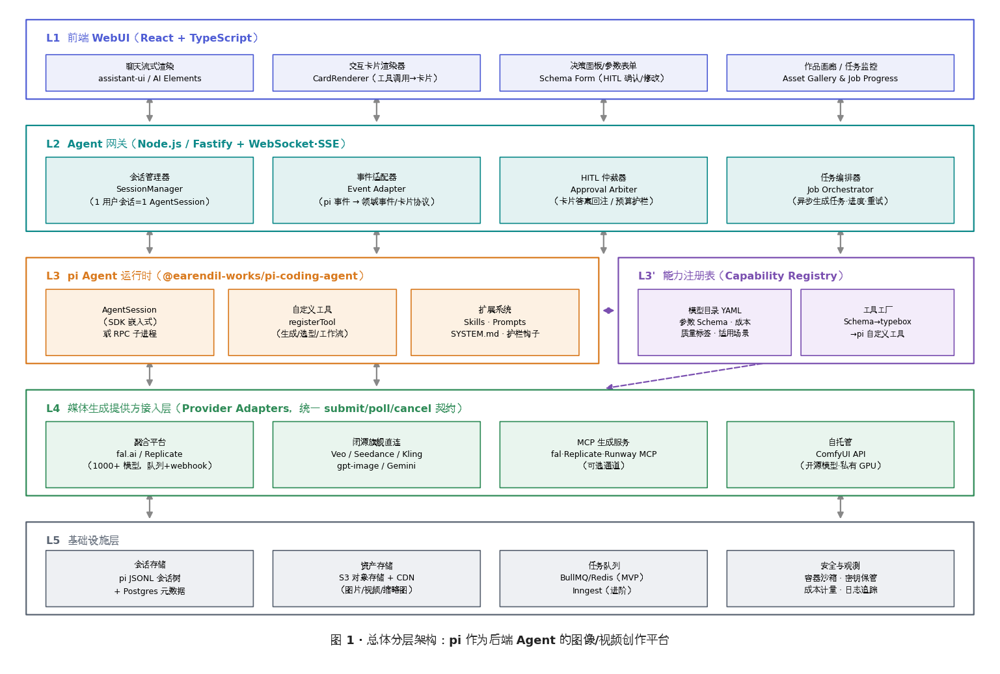
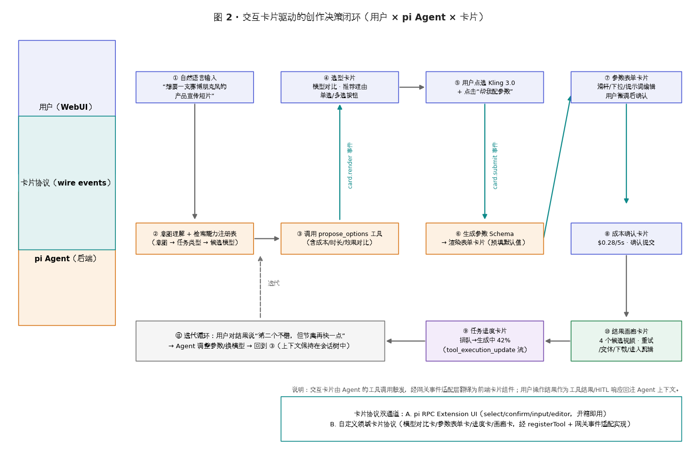
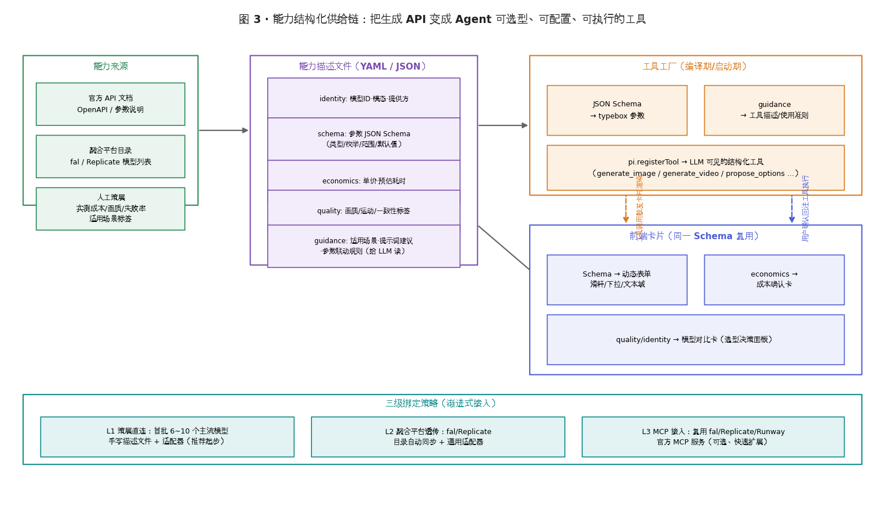
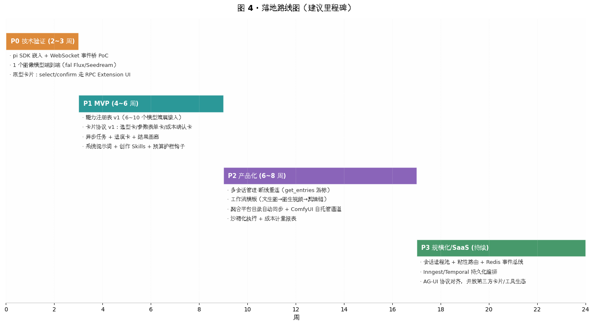

# 以 pi 为后端 Agent 的图像/视频创作平台：架构方案与技术选型报告

> 目标：将开源 Agent 工具包 **pi**（[earendil-works/pi](https://github.com/earendil-works/pi)）作为后端智能体运行时，前端采用 WebUI，通过**交互卡片/决策面板**引导用户用自然语言完成图像/视频创作；将图像/视频生成 API 以**结构化方式**供给给 Agent，使 pi 成为帮助用户完成**选型、决策、配置、执行**的"超级助手"。

---

## 执行摘要

**核心结论：pi 是目前少数几个"为被嵌入而设计"的开源 Agent 运行时，完全适配本场景。** 它提供四种运行模式（交互式 TUI、print/JSON、**RPC 子进程模式**、**SDK 嵌入模式**），其中 RPC 模式以 JSONL 协议暴露完整的命令/事件流，并且内置 **Extension UI Protocol**——扩展可以在 RPC 模式下通过 `select / confirm / input / editor` 四类对话框向宿主请求用户交互，这天然就是"交互卡片"的协议雏形（[pi RPC 文档](https://github.com/earendil-works/pi/blob/main/packages/coding-agent/docs/rpc.md)）。其 TypeScript 扩展系统支持 `registerTool` 注册自定义工具（typebox JSON Schema 参数）、`tool_call` 事件拦截（可阻断/改写参数，做预算与安全护栏）、`tool_result` 中间件（可改写结果注入 UI 载荷），加上 Skills、Prompt Templates、系统提示词替换等机制，足以把"图像/视频创作向导"作为一组**领域扩展包**注入 pi，而无需 fork 其内核（[pi Extensions 文档](https://github.com/earendil-works/pi/blob/main/packages/coding-agent/docs/extensions.md)）。

**推荐架构是五层模型**：前端 React WebUI（聊天流 + 卡片渲染器 + 参数面板 + 作品画廊）⇄ Agent 网关（Node.js，会话管理、事件适配、HITL 仲裁、任务编排）⇄ pi Agent 运行时（SDK 嵌入为主、RPC 子进程为隔离备选）⇄ 能力注册表（把每个生成模型描述为"参数 Schema + 成本 + 质量标签 + 使用指引"的结构化条目，编译为 pi 自定义工具与前端卡片 Schema）⇄ 媒体提供方接入层（fal.ai / Replicate 聚合平台、Veo/Seedance/Kling 等旗舰直连、ComfyUI 自托管，统一 submit/poll/cancel 契约）。该结构已被社区项目验证可行：**pi-cowork** 用 `createAgentSession → subscribe() → WebSocket → 浏览器` 实现了 Web 版 Claude Cowork，并用 `tool_call` 钩子实现了 Approve/Deny 审批卡片（[pi-cowork](https://github.com/ricardopera/pi-cowork)）；**Zetaphor/pi-webui** 以同样思路提供了全栈 Web 界面（[pi-webui](https://github.com/Zetaphor/pi-webui)）。

**交互卡片体系建议采用"双通道渐进"策略**：通道 A 直接复用 pi RPC 的 Extension UI Protocol 快速跑通选型/确认类卡片（零前端协议设计成本）；通道 B 定义领域卡片协议（模型对比卡、参数表单卡、成本确认卡、任务进度卡、结果画廊卡），由自定义工具调用触发、经网关事件适配层翻译为前端 React 组件——这与业界 2026 年收敛出的 **Generative UI 谱系**（AG-UI 受控式 → A2UI 声明式 → MCP Apps 开放式）中的"受控式"路线一致，是工程确定性与体验上限的最佳平衡点（[CopilotKit Generative UI](https://github.com/CopilotKit/generative-ui)）。落地节奏建议四阶段：**P0 技术验证（2~3 周）→ P1 MVP（4~6 周）→ P2 产品化（6~8 周）→ P3 规模化（持续）**，详见第九节路线图。

需要特别警示的一点是：**OpenAI 已宣布 Sora 视频 API 将于 2026 年 9 月 24 日停用**，不应将其纳入新系统的长期依赖（[Anikuku](https://anikuku.com/blog/seedance-2-vs-kling-runway-sora-2026)）；2026 年视频生成的事实格局是 **Seedance 2.x / Veo 3.1 / Kling 3.0 / Runway Gen-4.5** 四强按镜头类型分工，"按镜头选模型"比"押注单一模型"更能省钱提质（[Toolso](https://toolso.ai/blog/ai-video-tools-comparison)）——这正是"让 Agent 帮用户选型"这一产品命题的行业依据。

---

## 1. 目标解构与核心挑战

### 1.1 场景拆解

用户的目标是构建一个"对话式创作工作台"：用户用自然语言描述创作意图（例如"给我做一支赛博朋克风的产品宣传短片"），系统在 Agent 引导下逐步收敛为一次或一组**参数化生成任务**，最终交付图像/视频作品。这个过程天然包含五个环节：**意图理解 → 能力选型（选模型/选管线）→ 参数配置（分辨率、时长、风格、参考图等）→ 执行与监控（异步生成、进度反馈、失败重试）→ 评估与迭代（多候选对比、局部调整、变体生成）**。其中第二、三、四环节是专业门槛最高的部分，也是"Agent + 交互卡片"价值密度最高的部分——卡片把开放决策空间压缩为可点选的有限选项，Agent 负责把用户的模糊意图翻译为结构化参数，二者结合才是完整的"引导式创作"体验。

从产品形态看，该系统介于三类现有产品之间：一类是 **ChatGPT/Claude 式纯对话**（决策全靠文字往返，效率低）；一类是 **Midjourney/即梦式固定表单**（无智能引导，参数门槛高）；一类是 **ComfyUI 式节点工作流**（能力最强但学习曲线陡峭）。目标形态是第四种：**Agent 驱动的渐进式决策界面**——Agent 决定"什么时候问、问什么、给什么默认值"，卡片决定"怎么问"。2026 年这一形态已有行业共识名称：**Generative UI（生成式 UI）**，CopilotKit 将其整理为从"受控"到"开放"的三级谱系，本方案主取受控式（组件与卡片预先设计，Agent 决定何时渲染、填什么数据），辅之以声明式元素（参数表单由 Schema 驱动生成）（[CopilotKit Generative UI](https://github.com/CopilotKit/generative-ui)）。

### 1.2 四个核心技术挑战

**挑战一：pi 是编码 Agent，不是创作 Agent——如何"改造角色"？** pi 默认面向软件开发场景（内置 read/write/edit/bash 四个工具），但它本质是一个**可定制的 Agent 内核（harness）**：系统提示词可用 `.pi/SYSTEM.md` 整体替换，Skills 可以注入领域知识，扩展可以注册任意自定义工具并改写系统提示词中的工具指引（[pi README](https://github.com/earendil-works/pi/tree/main/packages/coding-agent)）。因此"改造"的正确姿势不是修改 pi 源码，而是交付一个 **pi 扩展包（Pi Package）**：内含创作向导系统提示词、模型选型 Skill、生成工具集、护栏钩子。pi 的包机制允许通过 npm/git 分发这类扩展包，这也让"创作能力"成为可版本化、可测试、可复用的独立工程产物。

**挑战二：生成 API 千差万别——如何让 Agent"看得懂、选得准、调得对"？** 2026 年的图像/视频模型在参数面（参考图数量、时长档位、分辨率档位、运动控制方式）、经济面（单价差一个数量级）、能力面（是否原生音频、是否支持区域编辑）上高度异构（[PixMind](https://www.pixmind.io/posts/seedance-2-5-vs-veo-sora-kling)）。解法是引入**能力注册表（Capability Registry）**作为中间层：每个模型被描述为一份结构化能力描述文件（参数 JSON Schema + 成本/耗时 + 质量标签 + 给 LLM 读的使用指引），由"工具工厂"统一编译为 pi 自定义工具，同一份 Schema 同时驱动前端参数表单。这样新增一个模型 = 新增一份描述文件 + 一个适配器，Agent 的选型能力随注册表增长而自动增强，无需改动对话逻辑。

**挑战三：对话是流式的，生成是异步长任务——如何统一交互模型？** LLM 对话以秒级 token 流推进，而视频生成动辄 1~3 分钟且可能排队，二者时间尺度差两个数量级。正确模型是**双轨事件流**：对话轨（pi 的 `message_update` / `tool_execution_*` 事件）负责即时反馈，任务轨（生成任务的 queued/running/succeeded/failed 状态机）负责长周期反馈，两轨在"任务进度卡片"上汇合——工具调用提交任务后立即返回 `job_id`（Agent 不被阻塞，可继续对话），任务状态变化以进度事件推送前端更新卡片，完成后 Agent 通过 `steer`/`followUp` 机制被唤醒并继续引导下一步。pi 的 steering/followUp 消息队列原生支持这种"异步唤醒"（[pi RPC 文档](https://github.com/earendil-works/pi/blob/main/packages/coding-agent/docs/rpc.md)）。

**挑战四：创作是要花钱的——如何防止 Agent"烧穿预算"？** 视频生成单价从 Kling 标准版的约 $0.07/5s 到 Veo 3 的约 $0.50/5s 不等，且行业经验失败率约 10%~20%、平均需要 2~3 次迭代才能产出可用结果，真实预算应为名义单价的 2.5 倍以上（[Crazyrouter](https://crazyrouter.com/en/blog/ai-video-generation-api-pricing-may-2026-comparison)）。护栏必须在**工具调用拦截层**强制执行（pi 的 `tool_call` 事件可阻断或改写参数），配合成本确认卡片把"预估花费"显性化给用户，而不是依赖提示词里的口头约束。这是架构级要求而非提示词工程技巧，必须在第一版就落地。

---

## 2. pi 能力盘点：为什么它能胜任"创作 Agent 后端"

### 2.1 项目定位与包结构

pi（[earendil-works/pi](https://github.com/earendil-works/pi)，前身为 badlogic/pi-mono）是一个 MIT 协议的开源 **Agent 工具包/内核（agent harness）**，由五个 npm 包组成：`pi-ai`（统一多提供商 LLM API，覆盖 Anthropic、OpenAI、Google、OpenRouter、Kimi、MiniMax 等 30+ 提供商及自定义 OpenAI/Anthropic/Google 兼容端点）、`pi-agent-core`（Agent 运行时：工具调用循环与状态管理）、`pi-coding-agent`（CLI + SDK + 扩展系统）、`pi-tui`（终端 UI）、`pi-telemetry`（遥测契约）（[pi README](https://github.com/earendil-works/pi)）。其设计哲学是"**让 pi 适应你的工作流，而不是相反**"——内核保持极简（默认只有 read/write/edit/bash 四个工具，不内置子代理、计划模式等重特性），一切领域能力通过扩展、技能、提示词模板注入。

对本项目而言，pi 的三个特质至关重要。其一，**模型自由**：pi-ai 的统一抽象意味着创作 Agent 的大脑可以随时切换（用 Claude 做精细引导、用更便宜的模型做参数闲聊），且 pi 维护各提供商可用模型的自动刷新目录，网关可通过 `get_available_models` 枚举后暴露给用户（[pi README](https://github.com/earendil-works/pi/tree/main/packages/coding-agent)）。其二，**会话即文件**：会话以 JSONL 树结构持久化，支持分支（fork/tree）、压缩（compaction）、按游标增量读取（`get_entries since`），这为 Web 场景的"断线重连、历史回放、多分支创作探索"提供了现成的存储语义（[pi RPC 文档](https://github.com/earendil-works/pi/blob/main/packages/coding-agent/docs/rpc.md)）。其三，**生态已有 Web 化先例**：官方姊妹项目 [pi-chat](https://github.com/earendil-works/pi-chat) 面向 Slack/聊天自动化，社区的 [pi-cowork](https://github.com/ricardopera/pi-cowork)（Web 版 Claude Cowork 克隆）与 [Zetaphor/pi-webui](https://github.com/Zetaphor/pi-webui) 均已验证"pi SDK + WebSocket + 浏览器"的可行性，本方案不是第一个吃螃蟹的。

### 2.2 集成面：四种模式与两条推荐路径

pi 有四种运行模式：交互式 TUI、print/JSON（一次性非交互输出）、**RPC 模式**（`pi --mode rpc`，JSONL 命令/事件流经 stdin/stdout）、**SDK 模式**（`createAgentSession()` 进程内嵌入）（[pi README](https://github.com/earendil-works/pi/tree/main/packages/coding-agent)）。对本项目有实际意义的是后两种，其能力对比与选型建议如下表：

| 维度 | SDK 嵌入（推荐主路径） | RPC 子进程（隔离备选） |
|---|---|---|
| 集成方式 | `createAgentSession()` 直接创建会话，`subscribe()` 订阅事件（[pi SDK 文档](https://github.com/earendil-works/pi/blob/main/packages/coding-agent/docs/sdk.md)） | 拉起 `pi --mode rpc` 子进程，stdin 写命令、stdout 读事件（[pi RPC 文档](https://github.com/earendil-works/pi/blob/main/packages/coding-agent/docs/rpc.md)） |
| 延迟/开销 | 进程内调用，最低 | 每会话一进程，JSONL 序列化开销 |
| 类型安全 | 完整 TypeScript 类型（`AgentSessionEvent` 等） | 需按 `rpc-types.ts` 自行对齐类型；官方提供 `rpc-client.ts` 参考实现 |
| 隔离性 | 与网关同生命周期，崩溃相互影响 | 进程级隔离，崩溃可独立重启；可整体放入容器沙箱 |
| 扩展 UI 协议 | 需自行实现 `ctx.ui` 的宿主端适配 | **内置**：select/confirm/input/editor 对话框走 `extension_ui_request/response` 子协议，开箱即用 |
| 多会话管理 | 网管进程内持有多个 `AgentSession`，调度自由（pi-cowork 即此模式） | 每会话一进程，天然隔离但进程数量受限 |
| 适用阶段 | P1 起的主力形态 | P0 快速验证 + 多用户隔离部署时的补充形态 |

**推荐策略：SDK 为主、RPC 为辅。** 理由有三：第一，SDK 的事件订阅粒度与 RPC 完全一致（同一事件源），而 pi-cowork 已经证明"每用户会话一个 `AgentSession`、服务端持有、事件映射为精简 wire schema 经 WebSocket 推给浏览器"这条链路工程上完全可行（[pi-cowork](https://github.com/ricardopera/pi-cowork)）；第二，SDK 模式下网关可以直接调用扩展 API（注册工具、注入消息、触发转向），实现卡片体系需要的"网关 ↔ Agent 双向控制"更顺滑；第三，RPC 模式仍有两个不可替代的场景——P0 阶段零适配成本地验证 Extension UI 卡片协议，以及未来多租户场景下用"一租户一容器化 RPC 进程"做硬隔离（pi 官方也建议用容器化解决其无内置权限系统的问题，提供 Gondolin 微 VM、纯 Docker、OpenShell 三种模式）（[pi README](https://github.com/earendil-works/pi)）。

### 2.3 事件流：前端实时性的数据源

无论 SDK 还是 RPC，前端需要的一切实时信号都来自 pi 的统一事件流。对本项目最关键的事件包括：`message_update`（text/thinking/toolcall 三级 delta，驱动打字机式渲染）、`tool_execution_start/update/end`（工具调用的完整生命周期，`update` 携带累积的部分结果，**这是生成任务进度条的数据源**）、`turn_start/end`、`agent_start/end/settled`（判断 Agent 何时空闲、何时可推送新卡片）、`compaction_*` 与 `auto_retry_*`（长会话压缩与自动重试的 UI 提示）（[pi RPC 文档](https://github.com/earendil-works/pi/blob/main/packages/coding-agent/docs/rpc.md)）。pi-webui 的实践经验值得注意：`AgentSessionEvent` 对象可能含循环引用或不可序列化字段，网关侧需要 `safeSerialize` 兜底，避免个别事件序列化失败拖垮整个推送管道（[pi-webui](https://github.com/Zetaphor/pi-webui)）。

事件适配层（Event Adapter）是网关的核心组件，职责是把 pi 的技术事件**翻译为领域事件**：例如把 `tool_execution_start(toolName="generate_video")` 翻译为"进度卡片出现"，把自定义工具返回的 `details.card` 载荷翻译为"渲染某类型卡片"，把 `tool_execution_update.partialResult` 翻译为"进度卡片更新到 42%"。这一翻译层是系统与 pi 之间的**防腐层（ACL）**——pi 升级导致事件结构变化时，只需调整适配器，前端卡片协议不受影响。建议卡片协议从第一天起就自定义领域语义（`card.render / card.update / card.submit / card.resolve`），而不是直接把 pi 事件透传给前端。

### 2.4 扩展系统：把"创作向导"做成可分发资产

pi 的 TypeScript 扩展系统提供五类与本项目直接相关的能力（[pi Extensions 文档](https://github.com/earendil-works/pi/blob/main/packages/coding-agent/docs/extensions.md)）。第一，**`pi.registerTool()`**：注册 LLM 可调用的自定义工具，参数用 typebox（JSON Schema）声明，支持 `promptSnippet`/`promptGuidelines` 注入系统提示词中的工具说明与使用准则——这正是"把生成 API 结构化提供给 Agent"的官方通道。第二，**`tool_call` 事件**：工具执行前触发，参数可变（`event.input` 可原地修改），返回 `{block, reason}` 可阻断——预算护栏、内容安全审核、参数合法性二次校验都挂在这里。第三，**`tool_result` 事件**：工具执行后触发，可改写结果内容——在此注入"给 LLM 的简洁文本摘要 + 给前端的卡片载荷 details"的双面结果。第四，**`pi.sendMessage()` / `sendUserMessage()`**：扩展或网关可向会话注入消息并触发新一轮对话，配合 `deliverAs: "steer" | "followUp"` 实现任务完成后的异步唤醒。第五，**生命周期与会话事件**（`session_start`、`before_agent_start` 等）：在会话启动时按用户/项目动态装配工具集与技能。

除扩展外，还有三样"无代码"定制件：**Skills**（SKILL.md 格式的按需加载知识包，例如"视频提示词写作指南""各模型风格手册"，Agent 自动加载，不占常驻上下文）、**Prompt Templates**（一键展开的可复用提示词，如"/广告分镜"）、**`.pi/SYSTEM.md`**（整体替换系统提示词，把 pi 从编码助手改写为"AI 创作总监"）（[pi README](https://github.com/earendil-works/pi/tree/main/packages/coding-agent)）。三者与扩展打包为一个 **Pi Package** 即可经 npm/git 分发，"创作能力包"由此成为独立交付物，与 pi 内核版本解耦演进。

### 2.5 Extension UI Protocol：被低估的卡片协议雏形

RPC 模式下，pi 扩展调用 `ctx.ui.select()/confirm()/input()/editor()` 时，pi 会向 stdout 发出 `extension_ui_request`（带唯一 id、方法名、标题、选项、超时），并阻塞等待客户端从 stdin 回写 `extension_ui_response`；另有 `notify/setStatus/setWidget/setTitle` 等 fire-and-forget 方法（[pi RPC 文档](https://github.com/earendil-works/pi/blob/main/packages/coding-agent/docs/rpc.md)）。这意味着：**一个跑在 RPC 模式下的 pi 扩展，可以用四行代码向任何宿主（包括我们的 Web 网关）发起一次"结构化提问"，pi 负责阻塞、超时兜底与结果回注**，网关只需把这四类请求渲染成卡片并把答案回写。SDK 模式下无此内置通道，但扩展中同样可以通过网关注入的桥接对象复刻同一语义（见 4.4 节）。

这个协议的价值在于它给出了**正确的阻塞语义**：对话框挂起的是扩展的执行流而非整个 Agent，超时自动以默认值解挂，客户端只需按 id 应答。pi-cowork 在 SDK 模式下用 `tool_call` 钩子 + 自定义 Approve/Deny 卡片实现了等价语义，证明两种通道在工程上可互换（[pi-cowork](https://github.com/ricardopera/pi-cowork)）。本方案的卡片双通道设计（见第 4 节）正是建立在这两套机制之上。

---

## 3. 总体架构设计

### 3.1 五层架构总览



系统划分为五层，各层职责与关键设计如下。**L1 前端 WebUI**：React + TypeScript 单页应用，包含四个功能区块——聊天流式渲染区（对话、思考过程、工具调用轨迹）、**交互卡片渲染器**（按卡片协议把工具调用渲染为可操作的卡片组件）、**决策面板/参数表单**（由 JSON Schema 驱动的动态表单，承载 HITL 确认与微调）、作品画廊与任务监控（生成结果的网格展示、版本对比、下载与再创作入口）。聊天基座建议直接使用 **assistant-ui** 或 **AI Elements** 这类成熟组件库——assistant-ui 原生支持"工具调用渲染为自定义 React 组件（Tool UI）""内联人工审批（human() interrupt）""数据事件驱动 UI（makeAssistantDataUI）"三种 Generative UI 机制，与本方案的卡片体系几乎一一对应（[assistant-ui Tool UI](https://www.assistant-ui.com/docs/tools/tool-ui)）。

**L2 Agent 网关**：Node.js（Fastify/Hono + ws）服务，是系统的控制中枢，包含四个子系统。**会话管理器**维护"用户会话 ↔ pi AgentSession"的一对一映射与生命周期（创建、挂起、恢复、销毁）；**事件适配器**完成 pi 事件 → 领域事件/卡片协议的双向翻译与防腐；**HITL 仲裁器**管理所有"等待用户决策"的挂起状态（卡片答案回注、超时策略、预算护栏的强制确认）；**任务编排器**负责生成任务的提交、轮询/webhook 接收、进度广播与失败重试。网关在单机上可以是一个进程同时持有多个 `AgentSession`（pi-cowork 模式），横向扩展时按会话做粘性路由（详见第 8 节）。

**L3 pi Agent 运行时**：以 SDK 嵌入方式运行 `AgentSession`，装配创作扩展包（自定义工具集 + 系统提示词 + Skills + 护栏钩子）。**L3' 能力注册表**：与运行时平行的只读知识层，存放所有生成模型的结构化能力描述，启动期经"工具工厂"编译为 pi 自定义工具，同时向网关暴露卡片 Schema 查询接口。**L4 提供方接入层**：四类通道（聚合平台、旗舰直连、MCP 服务、自托管 ComfyUI）统一收敛为 `submit(params) → jobHandle`、`poll(jobHandle) → status`、`cancel(jobHandle)` 的适配器契约。**L5 基础设施**：会话存储（pi JSONL + Postgres 元数据）、资产存储（S3 + CDN，生成结果必须落自有存储，因为 fal/Replicate 的输出 URL 多为临时地址）（[Wireflow](https://www.wireflow.ai/blog/best-ai-image-generation-mcp-tools-in-2026)）、任务队列、安全与观测设施。

### 3.2 关键链路：一次生成请求的完整生命周期

一次"用户说想法 → 拿到作品"的完整链路为：① 用户在 WebUI 输入自然语言，网关将其作为 `prompt` 送入对应 `AgentSession`；② pi 驱动 LLM 推理，调用 `search_capabilities` / `propose_options` 工具查询能力注册表，网关把工具调用翻译为**选型卡片**推送前端；③ 用户点选后，答案回注为工具结果，LLM 继续推理并调用 `configure_generation`，其参数 Schema 经网关翻译为**参数表单卡片**（预填 Agent 给出的默认值）；④ 用户微调确认，网关先做预算护栏校验（`tool_call` 拦截），通过后由任务编排器提交生成任务并立即向 Agent 返回 `job_id`；⑤ 任务进度经 webhook/轮询进入编排器，以 `tool_execution_update` 与进度卡片事件双通道推进；⑥ 任务完成，编排器下载资产落 S3，通过 `sendMessage(steer)` 唤醒 Agent，Agent 组织**结果画廊卡片**并给出下一步建议（变体、改参数、进入下一镜头）。全链路中 Agent 只在①②③⑥参与推理，④⑤ 是纯确定性流程——**"Agent 决策、系统执行"的边界清晰，是控制 LLM 成本与不确定性的关键设计**。

### 3.3 为什么不直接让 Agent 调"万能生成工具"

一个容易想到的反方案是：给 Agent 一个 `generate(prompt, model, params)` 万能工具，让它自由发挥。本方案明确否决这一做法，原因有三。第一，**上下文经济学**：2026 年仅主流视频模型就有 Seedance 2.5（30 秒/50 参考图/区域编辑）、Veo 3.1（8 秒/原生音频/电影感）、Kling 3.0（运动控制/原生 4K/性价比）等差异化极强的参数面（[PixMind](https://www.pixmind.io/posts/seedance-2-5-vs-veo-sora-kling)），若全部塞进单个工具的 Schema，工具描述会膨胀到数千 token 且参数冲突频发；按"每模型一工具 + 注册表动态装配"则按需挂载，上下文占用最小。第二，**决策可解释性**：拆分为 `propose_options → configure → confirm → submit` 的工具链后，每一步都有结构化产物（候选列表、参数草案、成本预估），既是前端卡片的数据源，也是审计与回放的依据。第三，**护栏可挂载点**：分离的 `submit` 工具是预算校验的天然拦截点，万能工具则把"确认"与"执行"混在一起，拦截语义含糊。这一设计与 MCP 生态 2026 年的教训一致——薄封装（一次调用一张图）的 MCP 服务器好接但不够用，生产级系统都把多步流水线收拢为可治理的结构化工具（[Wireflow](https://www.wireflow.ai/blog/best-ai-video-generation-mcp-tools-in-2026)）。

---

## 4. 交互卡片体系设计

### 4.1 Generative UI 谱系与本方案定位

2026 年 Agent×UI 交互已形成清晰的三级谱系：**受控式**（开发者预设计组件，Agent 决定何时渲染、填什么数据，代表协议 AG-UI）；**声明式**（Agent 用宿主公布的组件词汇表组装 JSON 组件树，代表协议 Google A2UI、Open-JSON-UI）；**开放式**（工具直接返回 HTML 资源，在沙箱 iframe 中渲染并经 postMessage 双向通信，代表协议 MCP Apps / OpenAI Apps SDK）（[CopilotKit Generative UI](https://github.com/CopilotKit/generative-ui)、[Agent-Ready](https://agent-ready.dev/what-is-a2ui)、[MCP Directory](https://mcp.directory/blog/mcp-apps-spec-2026-when-should-your-server-render-ui)）。三者在"自由度/工程确定性"上此消彼长，对比如下：

| 模式 | 代表协议/实现 | Agent 自由度 | 工程确定性 | 适用决策类型 | 本项目采用度 |
|---|---|---|---|---|---|
| 受控式 | AG-UI、Vercel AI SDK Tool UI、assistant-ui Tool UI | 低（选组件+填数据） | 高（组件可测、可审计） | 选型、确认、审批、进度 | **主力（90% 卡片）** |
| 声明式 | A2UI、assistant-ui `present` 工具（27 组件词汇表）（[assistant-ui Generative UI](https://www.assistant-ui.com/docs/tools/generative-ui)） | 中（组装布局） | 中（需词汇表白名单与校验） | 参数表单、对比看板 | 辅助（Schema 表单复用其思路） |
| 开放式 | MCP Apps（SEP-1865，2026-01-26 批准）（[MCP Apps](https://mcp.directory/blog/mcp-apps-spec-2026-when-should-your-server-render-ui)） | 高（自带 HTML） | 低（沙箱内黑盒） | 复杂内嵌工具（时间线剪辑器等） | 远期预留（不做首版） |

**选型结论：主力走受控式**。理由：本项目的卡片类型是有限可枚举的（见 4.2），且每张卡都关联真实金钱支出或长任务，必须可测试、可审计、可灰度——这是受控式的主场。声明式的价值在参数表单：表单控件无需逐字段手写 React，而是由能力注册表的 JSON Schema 驱动生成（本质上就是把 A2UI 的"词汇表+Schema"思路收窄到表单域）。开放式（MCP Apps）留作远期扩展：当需要"时间线剪辑""分镜画板"这类复杂内嵌工具时，可以把它们做成独立的微前端模块，参照 MCP Apps 的 iframe + postMessage 契约嵌入，而不侵入主卡片协议。

### 4.2 卡片清单：一张表定义全部交互原语



系统首版只需实现六类卡片，即可覆盖"引导式创作"的完整决策闭环：

| 卡片 | 触发方式（pi 侧） | 数据载荷 | 用户操作 | 回注方式 |
|---|---|---|---|---|
| **选型卡** ModelPickerCard | Agent 调用 `propose_options` 工具 | 候选模型数组：名称、模态、单价、预估耗时、质量标签、推荐理由、示例缩略图 | 单选/多选 + "帮我配参数"按钮 | 作为工具结果返回选中 modelId |
| **参数表单卡** ParamFormCard | Agent 调用 `configure_generation` 工具 | JSON Schema + Agent 预填默认值 + 字段级说明（tooltip） | 滑杆/下拉/文本编辑/参考图上传，确认或"交给 Agent 决定" | 校验后的参数对象作为工具结果 |
| **成本确认卡** CostConfirmCard | `tool_call` 拦截器在 `submit_generation` 前强制插入 | 单价 × 数量 = 预估总价、当前余额/配额、失败率提示 | 确认 / 取消 / 减少数量 | 确认放行工具执行，取消则 block 并说明 |
| **任务进度卡** JobProgressCard | `tool_execution_update` + 编排器状态推送 | jobId、状态机（queued/running/postprocessing）、百分比、预计剩余、可取消 | 取消任务 | 取消指令路由到编排器 |
| **结果画廊卡** GalleryCard | 任务完成后 Agent 调用 `present_results` | 资产 URL 数组、缩略图、元数据（seed、参数快照） | 选定/收藏/重试/生成变体/下载 | 用户选择作为 steer 消息唤醒 Agent |
| **自由问答卡** QuickReplyCard | pi Extension UI（select/confirm/input）或轻量 `ask_user` 工具 | 问题 + 选项按钮/输入框 | 点选或输入 | extension_ui_response 或工具结果 |

设计要点有三。其一，**所有卡片的 Schema 都是版本化的**（`cardType + version`），网关适配器负责把 pi 侧的工具载荷翻译为卡片协议，前端只认卡片协议——这样 pi 升级或工具重构不影响前端。其二，**卡片答案必须同时给两个消费者**：给 LLM 的是精简文本摘要（"用户选择了 kling-3.0-pro，参数为 {...}，预算确认通过"），给系统的是结构化对象（写入会话状态与任务记录），这通过 pi 工具结果的 `content`（给 LLM）与 `details`（给系统/前端）双通道天然支持（[pi Extensions 文档](https://github.com/earendil-works/pi/blob/main/packages/coding-agent/docs/extensions.md)）。其三，**进度卡与画廊卡复用 pi 的 steering 语义**：任务完成事件经 `sendMessage(deliverAs: "followUp")` 注入，Agent 在当前工作收尾后自然接续，不会粗暴打断正在进行的对话。

### 4.3 卡片协议线格式（建议）

```jsonc
// 网关 → 前端：渲染卡片
{"type": "card.render", "cardId": "c_01J…", "cardType": "param_form@v1",
 "sessionId": "s_123", "toolCallId": "call_abc",
 "payload": {"model": "kling-3.0-pro", "schema": {…}, "defaults": {…}},
 "timeout": 300000}
// 前端 → 网关：提交答案
{"type": "card.submit", "cardId": "c_01J…",
 "answer": {"params": {"duration": 5, "aspect_ratio": "16:9", …}, "action": "confirm"}}
// 网关 → 前端：增量更新（进度类卡片）
{"type": "card.update", "cardId": "c_01J…", "patch": {"progress": 0.42, "etaSec": 38}}
// 网关内部：解挂工具执行
{"type": "card.resolve", "cardId": "c_01J…", "resolution": "submitted" } // 或 timeout / cancelled
```

协议设计上建议向 **AG-UI** 的事件词汇靠拢（`TOOL_CALL_START/ARGS/END`、`STATE_DELTA`、`CUSTOM`），即使首版不实现完整 AG-UI，语义对齐也能保证未来可以低成本地把网关包装为标准 AG-UI endpoint，接入 CopilotKit 生态的前端组件（[AG-UI Docs](https://docs.ag-ui.com/introduction)）。AG-UI 社区的主流做法正是"适配器模式"——写一个 `AbstractAgent` 子类把既有 Agent 的事件流翻译为 AG-UI 事件，而非重写 Agent（[AI/TLDR](https://ai-tldr.dev/learn/ai-agents/tool-use/ag-ui-protocol/)），这与本方案的事件适配层完全同构。

### 4.4 双通道实现：RPC Extension UI 与自定义卡片

**通道 A（P0 快速通道）**：pi 以 RPC 模式运行，创作扩展中直接调用 `ctx.ui.select("选择生成模型", ["Kling 3.0", "Veo 3.1", "Seedance 2.5"])`，pi 自动发出 `extension_ui_request` 并阻塞等待；网关把请求渲染为卡片，用户点选后回写 `extension_ui_response`。这条通道**零协议设计成本**，适合验证"卡片引导是否提升转化率"这个产品假设，但表达力受限于四种对话框（选项列表、确认、单行输入、多行编辑器），无法做模型对比富卡片与参数表单。

**通道 B（P1 主力通道）**：SDK 嵌入模式下，自定义工具的 `execute()` 内部不直接执行，而是**挂起等待 HITL 仲裁器**：工具把卡片载荷写入 `onUpdate` 的 partialResult 并返回一个"等待用户输入"的 Promise，仲裁器持有 `cardId → resolve` 映射；前端提交答案后，网关调用 `resolve(answer)`，工具拿到答案继续执行或直接把答案作为结果返回。pi 工具执行器原生支持 `onUpdate` 流式部分结果与 AbortSignal 取消（[pi Extensions 文档](https://github.com/earendil-works/pi/blob/main/packages/coding-agent/docs/extensions.md)），因此该模式无需修改 pi 内核。通道 B 与通道 A 语义一致（挂起-应答-超时），可共享前端卡片组件，迁移成本仅在于把 `ctx.ui` 调用替换为桥接对象调用。

---

## 5. 能力结构化供给层：让 Agent 成为选型专家

### 5.1 能力描述文件：一切结构化的源头



能力注册表的每个条目是一份 YAML/JSON 描述文件，建议 schema 如下（示意）：

```yaml
id: kling-3.0-pro
provider: fal                       # 路由到哪个适配器
modality: [text2video, image2video]
identity:
  name: "Kling 3.0 Pro"
  vendor: Kuaishou
economics:
  unit_price: 0.28                  # USD / 5s @1080p（示例值，需以实时目录为准）
  billing_unit: "per_5s"
  est_latency_sec: 90
quality:
  resolution: ["720p", "1080p", "4k"]
  native_audio: true
  motion_control: true
  max_duration_sec: 15
  tags: ["cinematic", "motion-transfer", "value"]
params_schema:                      # 直接编译为 typebox + 前端表单
  type: object
  properties:
    prompt: {type: string, description: "运动与画面描述，建议包含镜头语言"}
    duration: {type: integer, enum: [5, 10, 15], default: 5}
    aspect_ratio: {type: string, enum: ["16:9", "9:16", "1:1"], default: "16:9"}
    reference_image: {type: string, format: asset-ref, description: "首帧参考图"}
  required: [prompt]
guidance:                           # 注入工具描述，给 LLM 读的"使用说明书"
  best_for: "运镜复杂、需要运动迁移的镜头；性价比优先的批量产出"
  avoid_for: "需要 8 秒以上连续叙事且要求原生对白的镜头（考虑 Seedance 2.5）"
  prompt_tips: "明确写出镜头运动（推/拉/摇/移）与主体动作，避免风格词堆砌"
  param_rules: "image2video 时 reference_image 必填；4k 仅 5s 档可用"
```

`guidance` 字段是整个设计中最容易被低估的部分：LLM 的选型质量不取决于它"知道"多少模型，而取决于工具描述里**结构化的对比信号**——适用/不适用场景、参数联动规则、提示词写作建议。这些信息以工具描述与 `promptGuidelines` 形式进入系统提示词（pi 官方建议 guideline 必须显式点名工具，如"Use generate_video when…"）（[pi Extensions 文档](https://github.com/earendil-works/pi/blob/main/packages/coding-agent/docs/extensions.md)）。同时建议把更厚的知识（各模型风格手册、分镜方法论）做成 **Skills** 按需加载，避免常驻上下文膨胀——pi 的 Skill 机制会在相关任务出现时自动加载对应 SKILL.md（[pi README](https://github.com/earendil-works/pi/tree/main/packages/coding-agent)）。

### 5.2 三级绑定策略：接入范围随阶段扩展

不建议第一天就追求"接入所有模型"，而应按三级渐进绑定。**L1 策展直连（P1，6~10 个模型）**：手写描述文件 + 每提供方一个适配器，覆盖一个经过深思熟虑的首发矩阵——图像侧如 Flux 2 Pro（质量档）、Seedream 4（中文场景）、Flux Schnell（极速草稿档，Replicate 上约 $0.003/张）（[ModelsLab](https://modelslab.com/best-ai-image-generation-api-2026)），视频侧如 Kling 3.0（性价比）、Veo 3.1（带音频电影感）、Seedance 2.5（长镜头/多参考）（[Teamday](https://www.teamday.ai/blog/best-ai-video-models-2026)）。策展的价值在于 `guidance` 质量——这是 Agent 选型能力的主要来源。

**L2 聚合平台透传（P2）**：接入 fal.ai 与 Replicate 的模型目录 API，自动同步模型清单与 OpenAPI Schema 生成描述文件草稿，人工只审核 `guidance` 与定价。两平台互补：fal 更快且同模型便宜 30~50%（Flux 2 Pro 约 3~5 秒出图，Kling 5s 视频约 60 秒），Replicate 目录最大且版本钉死（模型以不可变哈希版本化，可复现性最好）（[Teamday fal vs Replicate](https://www.teamday.ai/blog/fal-ai-vs-replicate-comparison)）。**L3 MCP 接入（P2 末，可选）**：fal（`mcp.fal.ai/mcp`）、Replicate（`mcp.replicate.com`）、Runway（`mcp.runwayml.com`）均已提供官方托管 MCP 服务（[AITuber](https://aituber.app/blog/best-mcp-servers-ai-video-generation/)），pi 扩展可作为 MCP client 接入，快速扩充长尾模型；但注意 MCP 通道的工具描述质量参差、缺少本方案依赖的 `guidance` 与经济学元数据，建议仅作为"探索性模型"的补充通道，主力模型仍走 L1/L2。

### 5.3 2026 模型格局：Agent 需要内化的选型知识

为了让能力注册表的 `guidance` 言之有物，以下格局应作为策展基线（数据为 2026 年年中公开资料，落地时需以实时目录复核）。图像侧：Flux 2 Pro/Dev 是通用质量基线（fal 约 $0.03~0.04/张量级），Seedream 4 在中文语义与文字渲染上领先（fal 约 $0.03/张），gpt-image-2 按 token 计费（$30/百万图像输出 token），Qwen-Image 系在开源/自托管侧性价比突出（[ModelsLab](https://modelslab.com/best-ai-image-generation-api-2026)）。视频侧四方格局：Seedance 2.5 单镜头最长 30 秒、最多 50 个多模态参考、支持区域级编辑；Veo 3.1 约 8 秒内电影感与原生音画同步最强；Kling 3.0 运动迁移与性价比最优且有原生 4K；Sora 2 已进入停用流程（API 2026-09-24 关停）（[PixMind](https://www.pixmind.io/posts/seedance-2-5-vs-veo-sora-kling)、[Anikuku](https://anikuku.com/blog/seedance-2-vs-kling-runway-sora-2026)）。价格带从 Kling 2.1 Standard 约 $0.07/5s 到 Veo 3 约 $0.50/5s，跨一个数量级（[Crazyrouter](https://crazyrouter.com/en/blog/ai-video-generation-api-pricing-may-2026-comparison)）。

行业共识是"**按镜头选模型，而非按项目选品牌**"（[Toolso](https://toolso.ai/blog/ai-video-tools-comparison)）——这恰好论证了本产品的核心价值主张：普通用户不可能掌握这张动态变化的选型地图，而结构化注册表 + Agent 引导可以。注册表还应内建"草稿-成片"双档策略的经济学知识：先用便宜模型（如 Kling Standard / Flux Schnell）快速出草稿让用户确认方向，再切贵模型出成片，可把迭代成本压缩数倍——这类策略性知识应写进 Skill 与系统提示词，成为 Agent 的默认工作方式。

---

## 6. 生成执行与工作流编排

### 6.1 异步任务契约与进度流

所有生成任务统一走"提交即返回"的异步契约：`submit` 返回 `{jobId, provider, estimatedSeconds}`，任务状态机为 `queued → running → postprocessing → succeeded | failed | cancelled`。状态推进有三个数据源，按提供方能力选用：webhook（fal/Replicate 均支持，最优）、轮询（兜底）、提供方流式订阅（fal queue 的 streaming 模式）。编排器收到状态后做三件事：更新任务记录（Postgres）、向会话推送进度事件（驱动进度卡片）、完成时下载资产落 S3 并生成缩略图。对 Agent 侧，进度通过自定义工具的 `onUpdate(partialResult)` 透出——pi 会把每次 update 作为 `tool_execution_update` 事件广播，前端进度卡片因此天然获得逐帧更新能力（[pi RPC 文档](https://github.com/earendil-works/pi/blob/main/packages/coding-agent/docs/rpc.md)）。

失败治理需要区分三类失败并给 Agent 不同的行动指引：**参数类失败**（Schema 校验拒绝、参考图不合规）→ Agent 读取错误详情后自动修正参数重试，并向用户解释；**容量类失败**（队列超时、提供方 5xx）→ 编排器指数退避重试，超过阈值后 Agent 建议切换等价模型（这正是注册表 `equivalents` 字段的用途）；**内容审核类失败**（提供方安全策略拒绝）→ 不可自动重试，Agent 引导用户调整提示词。行业经验失败率约 10~20%（[Crazyrouter](https://crazyrouter.com/en/blog/ai-video-generation-api-pricing-may-2026-comparison)），因此"失败-诊断-再试"不是边缘路径而是主路径，编排器与提示词都要按此设计。

### 6.2 编排引擎选型：队列 vs 持久化执行

MVP 阶段生成任务的持久化要求不高（分钟级、可重试、幂等），**BullMQ + Redis 足够**：任务即消息，worker 即适配器调用，进度经 Redis pub/sub 广播。进入产品化阶段后，当出现"多步创作工作流"（文生图 → 选图 → 图生视频 → 配音 → 拼接）需要跨小时、跨会话保持状态时，应引入**持久化执行（durable execution）**引擎。2026 年该领域的主流对比如下：

| 引擎 | 模型 | Agent/HITL 原语 | 运维成本 | 适配度评估 |
|---|---|---|---|---|
| **Inngest** | 事件驱动 step 函数，`step.run()` 记忆化 | 一等公民：事件等待、HITL 门控、AgentKit（[DigitalApplied](https://www.digitalapplied.com/blog/ai-workflow-orchestration-tools-2026-comparison)） | 低（无 worker，HTTP 回调现有部署） | **推荐**：TS 栈、与网关同语言、步骤级重试免去重复付费 |
| Temporal | 确定性 workflow + activity | 可建模但仪式重；需自行组合 agent 框架（[ZenML](https://www.zenml.io/blog/inngest-vs-temporal)） | 高（集群或 Cloud + worker 舰队） | 企业级规模化阶段再评估 |
| Trigger.dev | TS 原生任务平台 | 强（面向 AI 长任务与实时流）（[Noqta](https://noqta.tn/en/blog/durable-execution-ai-agents-inngest-trigger-temporal-2026)） | 低-中（可自托管） | 自托管硬需求时的替代 |
| BullMQ（现状） | Redis 队列 | 无（需自建） | 极低 | MVP 起步，P2 前不必替换 |

持久化执行的核心收益是**步骤级恢复**：一个五步创作工作流在第四步失败时，只重跑第四步而非整条链——社区基准显示此类改造平均可降低约 38% 的运行成本（[Noqta](https://noqta.tn/en/blog/durable-execution-ai-agents-inngest-trigger-temporal-2026)）。在按秒计费的视频生成场景，这直接等于省钱。

### 6.3 工作流模板 vs Agent 自由编排

创作工作流有两种组织方式，应并存而非二选一。**模板化工作流**（确定性管线）：把"广告短片""产品 360° 展示""壁纸套装"等高频场景固化为参数化模板（节点序列 + 每节点的模型偏好与参数约束），Agent 的角色退化为"帮用户填槽 + 逐节点确认"。其优点是成本与质量可预期、可灰度、可 A/B；实现上建议模板本身也是一份 YAML（与能力描述文件同构），由编排器解释执行，Agent 通过 `run_workflow` 工具触发。**自由编排**：Agent 根据对话即兴串联工具链，适合探索性创作。实践中建议的默认模式是"**模板为骨、Agent 为翼**"：Agent 优先推荐模板，用户偏离模板时平滑退化为自由编排；自由编排中被反复走通的路径，定期沉淀为新模板——这是把 Agent 的"隐性经验"转化为系统"显性资产"的飞轮。

---

## 7. 技术栈选型总表

| 层 | 组件 | 推荐选型 | 备选 | 选型理由 |
|---|---|---|---|---|
| 前端 | 框架 | React 18 + Vite + TypeScript | Next.js | 纯 SPA 即可；SSR 无必要；Vite 开发体验最优 |
| 前端 | 聊天基座 | **assistant-ui** | Vercel AI Elements、CopilotKit | 原生 Tool UI / human() 审批 / Data UI 三机制与卡片体系对应（[assistant-ui](https://www.assistant-ui.com/docs/tools/tool-ui)）；AI Elements 适合 AI SDK 全栈路线 |
| 前端 | 组件/样式 | shadcn/ui + Tailwind | — | 与 assistant-ui 主题生态同源 |
| 前端 | 动态表单 | Schema 驱动自研薄层（基于 shadcn 控件） | react-jsonschema-form、Formily | 表单域有限（滑杆/枚举/文本/资产引用），自研薄层比引入重型表单框架更可控 |
| 网关 | 服务框架 | **Fastify（或 Hono）+ ws** | Express | pi-cowork 已验证 Fastify+ws（[pi-cowork](https://github.com/ricardopera/pi-cowork)）；Hono 更轻且边缘友好 |
| 网关 | 实时通道 | WebSocket 为主，SSE 降级 | — | 卡片需要双向（render/submit），WS 一条通道全覆盖 |
| Agent | 运行时 | **@earendil-works/pi-coding-agent（SDK 模式）** | RPC 子进程模式 | 见 2.2 节对比；SDK 为主、RPC 用于验证与隔离 |
| Agent | LLM 提供商 | 经 pi-ai 接 Anthropic/OpenAI/Google/OpenRouter 等，可热切换 | Kimi、MiniMax、Z.ai 等 pi 内置提供商（[pi README](https://github.com/earendil-works/pi/tree/main/packages/coding-agent)） | pi-ai 统一抽象下成本/质量可按任务分档（引导对话用强模型，闲聊确认用便宜模型） |
| 能力层 | 注册表 | YAML 文件 + Git 版本管理 + 启动期编译 | Postgres 存储 + 管理后台 | 早期文件即数据库，评审走 PR；P2 后可加管理界面 |
| 提供方 | 聚合平台 | **fal.ai（主力）+ Replicate（互补）** | WaveSpeed、Atlas Cloud | fal 快且便宜 30~50%；Replicate 目录最大、版本钉死（[Teamday](https://www.teamday.ai/blog/fal-ai-vs-replicate-comparison)） |
| 提供方 | 自托管 | ComfyUI（API 模式） | LTX-2 单卡方案 | ComfyUI 支持 API 化触发工作流，适合私有 GPU 与开源模型（[MindStudio](https://www.mindstudio.ai/blog/local-ai-image-video-generation-comfyui)） |
| 存储 | 元数据 | Postgres | SQLite（单机期） | 任务/资产/用户/计费 |
| 存储 | 资产 | S3 兼容对象存储 + CDN | 本地磁盘 + 签名 URL（MVP） | 提供方 URL 多为临时地址，必须落自有存储（[Wireflow](https://www.wireflow.ai/blog/best-ai-image-generation-mcp-tools-in-2026)） |
| 编排 | 任务队列 | BullMQ + Redis（MVP）→ **Inngest**（P2） | Temporal、Trigger.dev | 见 6.2 节 |
| 沙箱 | 隔离 | Docker 容器运行 pi 进程（多用户时） | Gondolin 微 VM、OpenShell | pi 无内置权限系统，官方建议容器化（[pi README](https://github.com/earendil-works/pi)）；本场景可进一步禁用 bash/write 工具缩小攻击面 |
| 观测 | 追踪/计量 | OpenTelemetry + 任务级成本流水 | pi-telemetry | 每次生成记录 provider/model/params/cost，支撑预算护栏与定价 |

---

## 8. 安全、成本与规模化

### 8.1 安全模型：把攻击面收敛到"工具白名单"

pi 默认以启动用户的完整权限运行、无内置权限系统（[pi README](https://github.com/earendil-works/pi)），这在编码场景是特性，在面向终端用户的创作场景是必须收口的敞口。收口分四步。第一步，**工具白名单**：创建 `AgentSession` 时仅挂载创作工具集（`createAgentSession({tools: [...]})`），禁用 bash/read/write/edit——创作场景根本不需要文件系统与 shell 访问，这一刀砍掉 90% 攻击面。第二步，**参数护栏**：`tool_call` 钩子里做强制校验（参数范围、参考图来源域白名单、单任务成本上限、用户日配额），阻断即返回 `{block, reason}`，pi-cowork 已用同一钩子实现 Approve/Deny 机制（[pi-cowork](https://github.com/ricardopera/pi-cowork)）。第三步，**内容安全**：用户提示词与生成结果双向过审（文本分类 + 图像审核 API），审核拒绝走"内容审核类失败"路径。第四步，**进程隔离**：多用户部署时按"每租户一容器"运行 RPC 模式的 pi（或 SDK 进程池 + 容器池），密钥仅存在于网关侧、永不下发浏览器（pi-cowork 同样强调 keys 不出服务端）（[pi-cowork](https://github.com/ricardopera/pi-cowork)）。

### 8.2 成本治理：三层防线

第一层**预防**：成本确认卡强制显性化每次支出预估；系统提示词内建"草稿-成片"双档策略；Agent 默认推荐性价比档。第二层**拦截**：`tool_call` 护栏执行硬配额（单任务上限、日预算、并发上限），超限即阻断并给出降级建议（"本任务需 $1.2，超出您的日配额，可改用 Kling Standard 降至 $0.35，是否切换？"）。第三层**核算**：任务级成本流水（provider 账单对账 + 失败任务占比监控），失败率异常升高的模型自动降权——注册表的 `quality` 标签应是**动态字段**，由真实运行数据反哺，而非静态策展。行业经验值（失败率 10~20%、迭代 2~3 次）可作为初始先验（[Crazyrouter](https://crazyrouter.com/en/blog/ai-video-generation-api-pricing-may-2026-comparison)）。

### 8.3 规模化路径：从单机到 SaaS

单机阶段（~数百并发会话）：一个网关进程持有全部 `AgentSession`，Redis 做队列与广播，Postgres 存元数据——此架构可支撑 MVP 到早期产品的全部需求。规模化阶段引入四个改造：**会话进程池**（pi 运行时从网关进程剥离为独立 worker 池，按会话一致性哈希路由，网关只做协议终止与路由）；**事件总线**（进度与卡片事件经 Redis/NATS 在网关与 worker 间穿梭）；**会话再水合**（worker 崩溃后利用 pi 的 JSONL 会话文件与 `get_entries since` 游标在新 worker 上恢复会话与前端事件流）（[pi RPC 文档](https://github.com/earendil-works/pi/blob/main/packages/coding-agent/docs/rpc.md)）；**编排上云**（BullMQ → Inngest，获得跨实例的步骤级恢复）。值得强调的是 pi 的会话树模型在这里是隐形资产：创作探索天然是多分支的（"这个镜头再试三版"），fork/branch 语义由 pi 原生提供，前端只需把分支可视化为"版本树"即可（[pi README](https://github.com/earendil-works/pi/tree/main/packages/coding-agent)）。

---

## 9. 落地路线图



### 9.1 P0 技术验证（2~3 周）

目标是用最小成本验证三个技术假设：pi 能否被稳定嵌入 Web 后端、Extension UI 卡片能否跑通、一个生成模型能否端到端打通。具体交付：Fastify + ws 网关骨架，以 RPC 模式拉起 pi，实现 `prompt`/事件流/`extension_ui_request-response` 的桥接；一个最简创作扩展（`generate_image` 工具 + `ctx.ui.select` 模型选择 + `ctx.ui.confirm` 成本确认）；fal 上一个图像模型（如 Flux Schnell/Seedream）的适配器；前端单页（可临时用 assistant-ui 默认主题）完成"输入→选模型→确认→看图"闭环。**验收标准**：非技术人员在不看文档的情况下完成一次图像生成，全程无文字参数输入。

### 9.2 P1 MVP（4~6 周）

目标是把 P0 原型升级为可对内发布的产品骨架。交付：迁移至 SDK 嵌入模式与通道 B 卡片协议（六类卡片中的前四类：选型/参数/成本/进度）；能力注册表 v1（6~10 个策展模型，图像 4 + 视频 4~6）；异步任务编排（BullMQ）与结果画廊；创作系统提示词 + 两个 Skill（提示词写作指南、模型选型手册）+ 预算护栏钩子；资产落 S3。**验收标准**：完成一条"文生图 → 选图 → 图生视频"的两步链式创作；预算护栏可演示（超限被阻断并给出降级建议）；单会话断线刷新后历史与进度可恢复。

### 9.3 P2 产品化（6~8 周）

目标是支撑真实用户的日常使用。交付：多会话管理与会话列表、pi 会话分支的可视化（版本树）；工作流模板机制与 2~3 个首发模板；fal/Replicate 目录自动同步（L2 绑定）+ ComfyUI 自托管通道；成本核算报表与动态质量标签；容器化部署与安全收口（工具白名单、内容审核）。**验收标准**：外部小流量灰度；模板创作占比与自由编排占比可度量；单任务端到端成本（LLM + 生成）可核算到分。

### 9.4 P3 规模化与生态化（持续）

目标是 SaaS 化与生态开放。交付：会话进程池与粘性路由、事件总线、Inngest 持久化编排；卡片协议向 AG-UI 对齐并开放第三方工具/卡片接入规范；探索 MCP Apps 式复杂内嵌工具（时间线剪辑、分镜画板）；多语言与团队协作（共享工作流模板市场）。**验收标准**：百级并发会话下 P95 首 token 延迟与单机持平；第三方开发者可按规范贡献一个新模型适配器而无需改动核心代码。

---

## 10. 风险登记册与开放问题

| 风险 | 等级 | 说明与缓解 |
|---|---|---|
| **pi 项目治理风险** | 中 | pi 迭代极快且维护者明确表示新贡献者的 Issue/PR 默认自动关闭（[pi README](https://github.com/earendil-works/pi)），上游沟通渠道有限。缓解：锁版本升级、扩展层不依赖内部 API、保留 fork 维护能力 |
| **模型 API 变动/下线** | 高 | Sora 从旗舰到宣布停用作废不足一年（2026-09-24 API 关停）（[Anikuku](https://anikuku.com/blog/seedance-2-vs-kling-runway-sora-2026)）。缓解：注册表抽象 + 适配器契约，模型即配置；`equivalents` 字段支撑自动降级 |
| **LLM 选型质量不稳定** | 中 | Agent 可能做出次优模型推荐。缓解：`guidance` 策展 + 动态质量标签 + 推荐可解释（卡片上必须给出理由）；关键路径用模板化工作流兜底 |
| **成本失控** | 高 | 视频生成单价高、迭代多。缓解：三层成本防线（8.2 节）从 P1 就强制落地，不延后 |
| **卡片协议过度设计** | 中 | 首版卡片类型膨胀会拖慢交付。缓解：严格限定六类卡片，新增卡片类型需走评审 |
| **合规与版权** | 中 | 生成内容版权归属、提供方商用条款（如 Runway 积分制商用授权、各平台内容政策）逐条各异。缓解：注册表增加 `license` 元数据并在选型卡上透出；企业版需提供合规报告 |

三个值得团队尽早回答的开放问题：其一，**Agent 的"人格"边界**——它是导购（推荐平台接入的一切）还是顾问（敢于说"这个需求不值得用视频生成"）？这决定系统提示词与 `guidance` 的写法，建议顾问定位以建立长期信任。其二，**作品数据的所有权与复用**——用户生成的资产是否进入平台素材库、是否用于改进推荐（需要明确的授权机制）。其三，**计费模式**——成本穿透（用户自付 API 费）、积分制还是订阅包含额度，将反向影响成本护栏的实现位置与选型卡的呈现方式。这三个问题不改变本报告的技术架构，但应在 P1 结束前形成结论。

---

*本报告基于 2026 年 9 月 1 日前可获取的公开资料与 pi 官方文档撰写；模型价格、可用性与 API 条款变化频繁，落地实施前请以各提供方实时目录复核。*
